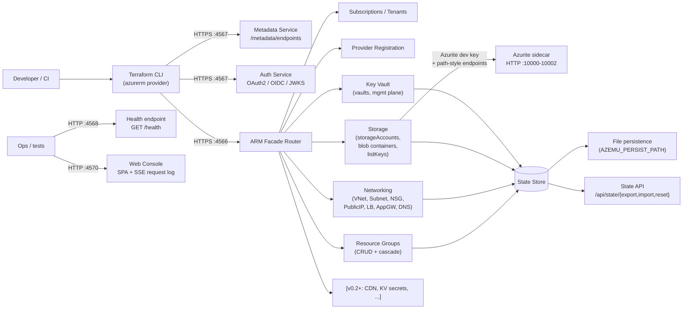

# Architecture -- azemu

How azemu is wired together. For coding conventions see `docs/CONVENTIONS.md`.
For what is implemented see `docs/PARITY.md`.

## Request flow



```text
Developer / CI
    |
    v
Terraform CLI -----> HTTPS :4567 -----> Metadata Service (/metadata/endpoints)
    |                                    Auth Service (OAuth2, OIDC, JWKS)
    |
    +---------------> HTTPS :4566 -----> ARM Facade Router
                                           +-- Subscriptions / Tenants
                                           +-- Provider Registration
                                           +-- Resource Groups (CRUD + cascade)
                                           +-- Networking (VNet, Subnet, NSG,
                                           |   PublicIP, LB, AppGW, DNS zones+records)
                                           +-- Storage (storageAccounts, blob containers,
                                           |   listKeys -> Azurite dev key)
                                           +-- Key Vault (vaults, management plane)
                                           +-- [v0.2+: CDN, KV secrets, ...]
                                         |
                                         v
                                      State Store (memory or file)
                                         |
                                         v
                                      State API (/api/state/{export,import,reset})

Azurite sidecar (HTTP :10000-10002)
    ^
    |  path-style endpoints returned in primaryEndpoints block
    +-- ARM Storage handlers (AZEMU_AZURITE_ENDPOINT)

Ops / tests ----------> HTTP :4570 -------> Web Console (embedded SPA)
                                              +-- SSE request log (GET /api/requests/stream)
```

Both ports serve HTTPS using the same self-signed ECDSA P-256 certificate.
Port 4566 must be HTTPS because the `azurerm` provider classifies environments
whose `resourceManager` URL uses `http://` as Azure Stack and rejects them.

## How provider redirection works

The `hashicorp/azurerm` Terraform provider has a `metadata_host` field. When
set, the provider calls `https://{metadata_host}/metadata/endpoints` to
discover Azure service URLs instead of using built-in cloud profiles. The
provider code does:

```go
environments.FromEndpoint(ctx, fmt.Sprintf("https://%s", metadataHost))
```

azemu serves this endpoint and returns URLs pointing back to itself, so all
subsequent ARM calls, token requests, and data plane calls stay local.

This requires:

- HTTPS on `:4567` with a self-signed cert (TLS mandatory for metadata).
- HTTPS on `:4566` for ARM and data plane (HTTP triggers `IsAzureStack` rejection).
- A canonical metadata schema matching real Azure verbatim, so `go-azure-sdk`
  can build per-service authorizers without falling through to the Azure Stack
  rejection path. See `internal/metadata/service.go` and its regression tests.
- Mock OAuth2 token endpoint returning valid RS256-signed JWTs.
- Case-insensitive ARM path normalization — azurerm sends camelCase
  `resourceGroups`; chi routes are lowercase. See
  `internal/middleware/pathcase.go`.

## Host-routed data planes (Key Vault, CDN)

Two Azure data planes are addressed by host rather than by ARM path, so azemu
multiplexes them on the ARM port (`:4566`) behind a host check, the same way
real Azure serves them from distinct hostnames. A wrapper inspects the request
`Host` before the ARM router sees it:

- `{vault}.vault.localhost` -> the Key Vault secrets/keys data plane. The
  `vaultUri` returned by the management plane points here; the handler resolves
  the vault from the host. See `internal/arm/router.go` (`vaultNameFromHost`).
- `{endpoint}.azureedge.net` -> the CDN content data plane. The handler resolves
  the CDN endpoint from the host, finds its Blob origin
  (`{account}.blob.core.windows.net` -> the storage account), and reverse-proxies
  the request to Azurite path-style (`{AZEMU_AZURITE_ENDPOINT}/{account}/...`),
  passing the origin's `Content-Type` and `Cache-Control` through unchanged.
  That mirrors Azure CDN honouring origin metadata by default. `GET`/`HEAD`
  only. See `internal/arm/cdn_dataplane.go`.

Both hosts are covered by wildcard SANs (`*.vault.localhost`, `*.azureedge.net`)
on the self-signed cert, so a client that trusts the azemu cert and resolves the
host to `127.0.0.1` reaches them over TLS on `:4566`.

## Package layout

```text
cmd/azemu/main.go              entrypoint, server setup, graceful shutdown
internal/
  metadata/service.go          /metadata/endpoints (canonical Azure schema)
  auth/token.go                OAuth2 token endpoint, OIDC discovery, JWKS
  auth/tls.go                  LoadOrGenerateSelfSignedTLS persists via AZEMU_CERT_PATH
  arm/router.go                ARM facade: subscriptions, providers, RG-resources list
  arm/resourcegroup.go         resource group CRUD (cascade delete via store prefix)
  arm/vnet.go                  virtual networks CRUD + HEAD + embedded child subnets
  arm/subnet.go                subnets CRUD + HEAD with parent-vnet existence check
  arm/nsg.go                   network security groups + security rules (child resources)
  arm/public_ip.go             public IP addresses CRUD + HEAD
  arm/lb.go                    load balancers + backend pools, rules, probes
  arm/appgw.go                 application gateways (monolithic PUT)
  arm/dns.go                   DNS zones + record sets (A/AAAA/CNAME/TXT/MX/SRV/NS/SOA)
  arm/storage_account.go       storage accounts CRUD + listKeys (Azurite dev key)
  arm/storage_container.go     blob containers CRUD (child of storage account)
  arm/keyvault.go              key vaults CRUD (management plane; vaultUri computed)
  arm/helpers.go               shared ARM response builders, error formatting
  store/store.go               Store interface definition
  store/memory.go              in-memory implementation
  store/file.go                write-through file-backed implementation
  middleware/azure.go          Azure headers, api-version enforcement
  middleware/pathcase.go       NormalizePath: lowercase canonical ARM literals, collapse `//`
  middleware/logging.go        request/response logging with zerolog
  middleware/request_log.go    RequestRecorder: ring buffer + SSE fan-out for web console
  middleware/unhandled.go      catch-all for unrouted paths (log + 501)
  console/embed.go             embed.FS SPA handler for the web console (port 4570)
pkg/
  config/config.go             env-based config (ports, CertPath, AzuriteEndpoint, ...)
  armtypes/types.go            shared ARM request/response structs
test/
  integration/arm_test.go      in-process httptest CRUD across all implemented resources
docs/
  adr/                         Architecture Decision Records (ADR 0001: Azurite delegation)
  ARCHITECTURE.md              this file
  CONVENTIONS.md               Go style, ARM contracts, auth contracts, testing strategy
  PARITY.md                    Full/Stub/None matrix per resource
  SETUP.md                     contributor onboarding (flox + manual paths)
.claude/rules/                 path-scoped rules for coding agents
.flox/env/manifest.toml        pinned dev env (Go, Terraform, pre-commit, ...)
.pre-commit-config.yaml        whitespace + go vet/build + golangci-lint + markdownlint
```

## Dependency direction (enforced)

```text
cmd/azemu ---> internal/* ---> pkg/*
                           ---> store.Store (interface)
```

Inside `internal/`:

- `arm/` may import `store/` and `pkg/armtypes/`
- `metadata/` may import `pkg/config/`
- `middleware/` and `auth/` are standalone
- No cross-imports between sibling internal packages

If you need a shared type across `internal/*` packages, promote it to `pkg/`.

## Dependencies (go.mod)

| Package | Purpose | Pinned |
|---------|---------|--------|
| `go-chi/chi/v5` | HTTP routing | ~v5.1 |
| `golang-jwt/jwt/v5` | JWT creation/validation | ~v5.2 |
| `google/uuid` | Request IDs | ~v1.6 |
| `rs/zerolog` | Structured logging | ~v1.33 |

Standard library for TLS, crypto, testing, flags, JSON. Do not add cobra,
viper, urfave/cli, testify, gomock, or any other framework without approval.
