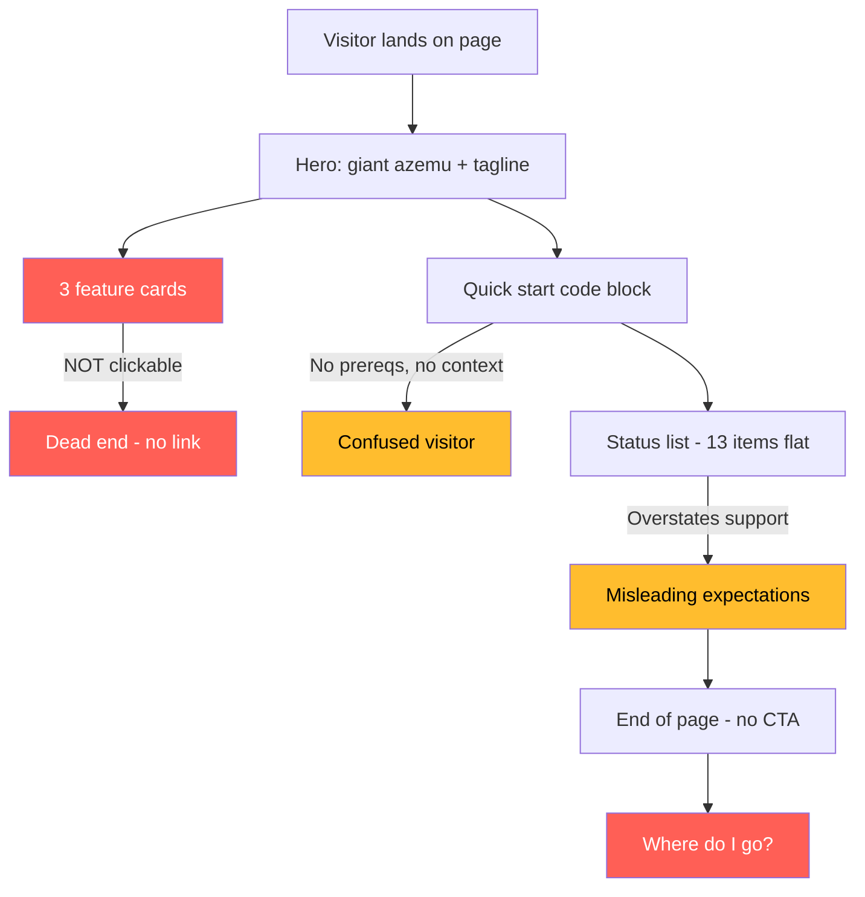
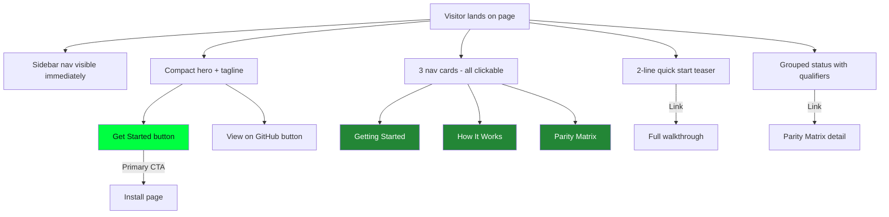

# azemu Home Page Redesign -- Design Spec

## Problem Statement

The current home page at zerodeth.github.io/azemu creates a disorienting
first experience. A visitor clicking the link lands on a page with:

- No sidebar navigation (hidden via frontmatter)
- No clear call-to-action or "start here" path
- Three feature cards that look clickable but go nowhere
- A raw quick-start code block with no prerequisites
- A flat status list that overstates resource support
- No links to GitHub, issues, or community

The visitor's journey is: arrive, read marketing copy, see a scary code
block, see a misleading bullet list, hit the end of the page, and wonder
"where do I actually go?" This is the opposite of what a documentation
landing page should do.

## Design Principles

Learned from studying LocalStack, minikube, and Material for MkDocs:

1. **Orient first, sell second.** The visitor already clicked the link.
   They need to know where they are and where to go, not be convinced
   this is a good project.

2. **Navigation is not optional.** Hiding the sidebar on the only page
   every visitor sees first is hostile. The sidebar is the map.

3. **Every visual element must go somewhere.** If a card has a hover
   effect, it must be a link. Decorative interactivity is a broken
   promise.

4. **Show the path, not the destination.** A quick-start code block is
   the destination. The path is: "you need Docker and Terraform, here
   is how to install, here is your first apply." Guide, do not dump.

5. **Honesty builds trust.** "AKS" without "(management plane only)"
   is a lie by omission. Someone who tries full AKS emulation and fails
   will not come back.

## Current vs. Proposed Structure

### Current (broken)



Sidebar: **hidden**. The visitor has no map.

### Proposed



Sidebar: **visible**. The visitor can navigate from second one.

## Detailed Changes

### 1. Remove `hide: [navigation, toc]`

**Why:** The sidebar is the primary navigation mechanism for every page
in the site. Hiding it on the landing page means the visitor has to
discover the site structure by following inline links, which is like
removing the table of contents from a book's first page.

**What:** Delete the frontmatter `hide` block entirely. The sidebar
appears on the left with the full nav tree, exactly as it does on
every other page.

### 2. Compact the hero

**Why:** The current hero takes up most of the viewport with a giant
"azemu" heading and tagline. On a docs site (not a marketing site),
the hero should orient, not dominate.

**What:**

- Keep the `azemu` heading and tagline with blinking cursor
- Reduce padding from `3rem 1rem 2rem` to `2rem 1rem 1rem`
- Add two CTA buttons below the tagline:
  - **Get Started** (primary, green) links to `getting-started/install.md`
  - **View on GitHub** (secondary, outlined) links to the repo

### 3. Replace dead feature cards with navigation cards

**Why:** The current cards ("No subscription", "No provider forks",
"Terraform-first fidelity") are marketing copy with no links. They
look interactive (hover effect changes border color) but clicking
does nothing. This is a broken affordance that frustrates visitors.

**What:** Replace with three clickable navigation cards that serve as
signposts:

| Card | Title | Description | Links to |
|------|-------|-------------|----------|
| 1 | Getting Started | Install azemu and run your first `terraform apply` in minutes | `getting-started/install.md` |
| 2 | How It Works | The metadata-redirect pattern, ARM fidelity, and what gets emulated | `getting-started/how-it-works.md` |
| 3 | Parity Matrix | Which Azure resources are supported and at what depth | `concepts/parity-matrix.md` |

Each card is an `<a>` tag wrapping the entire card div. The hover
effect now indicates "this is a link" (which it is). The cursor
changes to pointer.

### 4. Replace the raw quick-start code block with a teaser

**Why:** The current code block dumps 6 commands with no prerequisites,
no explanation of what they do, and no indication of what the output
should look like. The `export SSL_CERT_FILE` line looks scary. The
`terraform destroy` at the end is confusing ("why destroy what I just
made?").

**What:** Replace with a minimal 3-command teaser that shows the
essence, followed by a link to the full walkthrough:

```bash
docker compose up -d --build
./scripts/aztf -chdir=examples/terraform apply -auto-approve
```

> Requires Docker and Terraform 1.6+.
> See [Your First Apply](getting-started/first-apply.md) for the
> full walkthrough with expected output.

The `aztf` wrapper handles the cert trust automatically, so the
scary `export SSL_CERT_FILE` line disappears. The teaser shows
"start it, run terraform" and the link explains the rest.

### 5. Fix the status section

**Why:** The current list implies full emulation for 13 resource types.
"AKS" and "Key Vault" are management-plane-only stubs. "Azure DevOps
OIDC and service connections" is not an Azure resource type and confuses
visitors. The flat list gives no sense of depth.

**What:** Replace with a grouped, qualified summary:

**Networking:**
Resource Groups, Virtual Networks, Subnets, Public IPs, NSGs, Load
Balancers, Application Gateways, DNS Zones

**Storage and secrets:**
Storage Accounts (data plane via Azurite), Key Vault (management plane)

**Compute and identity:**
Managed Identities, AKS (management plane)

**CI/CD integration:**
CDN Profiles/Endpoints, Azure DevOps service connections

Each group is a short line, not a bullet list. Parenthetical
qualifiers like "(management plane)" and "(data plane via Azurite)"
set honest expectations. End with a link:

> See the [Parity Matrix](concepts/parity-matrix.md) for the full
> resource support matrix.

### 6. Add CTA button styles to the CSS

**Why:** Material for MkDocs does not have built-in button components.
The hero needs "Get Started" and "View on GitHub" buttons.

**What:** Add `.azemu-cta` and `.azemu-cta--secondary` classes:

- Primary: green background, dark text, monospace font, no underline
- Secondary: transparent background, green border, green text
- Both: inline-block, padding, border-radius, hover transitions
- Mobile: stack vertically with full width

### 7. Make nav cards fully clickable

**Why:** The current `.azemu-feature` cards are `<div>` elements. Even
with a link inside, only the link text is clickable, not the full card
surface. This is poor UX.

**What:** Wrap each card in an `<a>` tag. Add CSS to make the entire
card surface clickable:

- `.azemu-feature a` covers the full card area
- Remove default link underline/color on the card wrapper
- Card text uses normal content colors, not link-blue
- Hover changes border color (existing behavior now has meaning)

## What Does NOT Change

- The Industrial Terminal visual theme (colors, fonts, code blocks,
  terminal dots) stays exactly as-is
- The mkdocs.yml nav structure stays the same
- All other pages are untouched
- The site footer, header, search, and scrollbar styling are unchanged
- Light mode / dark mode toggle behavior is unchanged

## Success Criteria

A visitor arriving at the home page for the first time should:

1. See the sidebar navigation immediately (know the site structure)
2. Understand what azemu is within 3 seconds (hero + tagline)
3. Know their next step within 5 seconds (green "Get Started" button)
4. Be able to navigate to any section without scrolling (sidebar)
5. Not encounter any element that looks interactive but is not
6. Have accurate expectations about resource support depth
7. Be able to reach GitHub from the landing page (header repo link +
   CTA button)

## Files to Modify

| File | Change |
|------|--------|
| `website/docs/index.md` | Rewrite content per sections 1-5 above |
| `website/docs/stylesheets/extra.css` | Add CTA button styles, update card styles per sections 6-7 |
| `website/mkdocs.yml` | No changes needed (sidebar visibility is controlled by frontmatter, not config) |

## Out of Scope

- Changing the nav structure in mkdocs.yml
- Adding new pages
- Modifying other pages
- JavaScript (all changes are CSS + markdown)
- Logo or favicon changes
