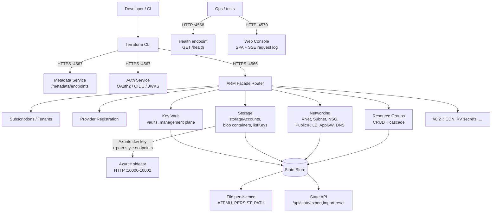

# Architecture

## Request flow



Both ports serve HTTPS using the same self-signed ECDSA P-256 certificate.
Port 4566 must be HTTPS because the azurerm provider classifies environments
whose `resourceManager` URL uses `http://` as Azure Stack and rejects them.

## How provider redirection works

The `hashicorp/azurerm` Terraform provider has a `metadata_host` field. When
set, the provider calls `https://{metadata_host}/metadata/endpoints` to
discover Azure service URLs instead of using built-in cloud profiles. The
provider code does:

```go
environments.FromEndpoint(ctx, fmt.Sprintf("https://%s", metadataHost))
```

azemu serves this endpoint and returns URLs pointing back to itself, so all
subsequent ARM calls, token requests, and data-plane calls stay local.

This requires:

- HTTPS on `:4567` with a self-signed cert (TLS mandatory for metadata).
- HTTPS on `:4566` for ARM and data plane (HTTP triggers `IsAzureStack` rejection).
- A canonical metadata schema matching real Azure verbatim, so `go-azure-sdk`
  can build per-service authorizers without falling through to the Azure Stack
  rejection path.
- Mock OAuth2 token endpoint returning valid RS256-signed JWTs.
- Case-insensitive ARM path normalization: azurerm sends camelCase
  `resourceGroups`; chi routes use lowercase literals.

## Host-routed data planes (Key Vault, CDN)

Two Azure data planes are addressed by host rather than by ARM path, so azemu
multiplexes them on the ARM port (`:4566`) behind a host check, the same way
real Azure serves them from distinct hostnames:

- `{vault}.vault.localhost` serves the Key Vault secrets/keys data plane. The
  `vaultUri` returned by the management plane points here, and the handler
  resolves the vault from the host.
- `{endpoint}.azureedge.net` serves the CDN content data plane. The handler
  resolves the CDN endpoint from the host, finds its Blob origin
  (`{account}.blob.core.windows.net`), and reverse-proxies the request to
  Azurite path-style, passing the origin's `Content-Type` and `Cache-Control`
  through unchanged (`GET`/`HEAD` only). This is how Azure CDN honours origin
  metadata by default.

Both hosts are covered by wildcard SANs (`*.vault.localhost`,
`*.azureedge.net`) on the self-signed cert, so a client that trusts the azemu
cert and resolves the host to `127.0.0.1` reaches them over TLS on `:4566`.

## Package layout

```text
cmd/azemu/main.go              entrypoint, server setup, graceful shutdown
internal/
  metadata/service.go          /metadata/endpoints (canonical Azure schema)
  auth/token.go                OAuth2 token endpoint, OIDC discovery, JWKS
  auth/tls.go                  LoadOrGenerateSelfSignedTLS (persists via AZEMU_CERT_PATH)
  arm/router.go                ARM facade: subscriptions, providers, RG-resources list
  arm/resourcegroup.go         resource group CRUD (cascade delete via store prefix)
  arm/vnet.go                  virtual networks CRUD + HEAD + embedded child subnets
  arm/subnet.go                subnets CRUD + HEAD with parent-vnet existence check
  arm/nsg.go                   network security groups + security rules (child resources)
  arm/public_ip.go             public IP addresses CRUD + HEAD
  arm/lb.go                    load balancers + backend pools, rules, probes
  arm/appgw.go                 application gateways (monolithic PUT)
  arm/dns.go                   DNS zones + record sets (A/AAAA/CNAME/TXT/MX/SRV/NS/SOA)
  arm/storage_account.go       storage accounts CRUD + listKeys (Azurite dev key)
  arm/storage_container.go     blob containers CRUD (child of storage account)
  arm/keyvault.go              key vaults CRUD (management plane; vaultUri computed)
  arm/helpers.go               shared ARM response builders, error formatting
  store/store.go               Store interface definition
  store/memory.go              in-memory implementation
  store/file.go                write-through file-backed implementation
  middleware/azure.go          Azure headers, api-version enforcement
  middleware/pathcase.go       NormalizePath: lowercase canonical ARM literals, collapse //
  middleware/logging.go        request/response logging with zerolog
  middleware/unhandled.go      catch-all for unrouted paths (log + 501)
pkg/
  config/config.go             env-based config (ports, CertPath, AzuriteEndpoint, ...)
  armtypes/types.go            shared ARM request/response structs
test/
  integration/arm_test.go      in-process httptest CRUD across all implemented resources
```

## Dependencies

| Package | Purpose | Pinned |
|---------|---------|--------|
| `go-chi/chi/v5` | HTTP routing | ~v5.1 |
| `golang-jwt/jwt/v5` | JWT creation/validation | ~v5.2 |
| `google/uuid` | Request IDs | ~v1.6 |
| `rs/zerolog` | Structured logging | ~v1.33 |

Standard library covers TLS, crypto, testing, flags, and JSON. No external
CLI or testing frameworks are used.
