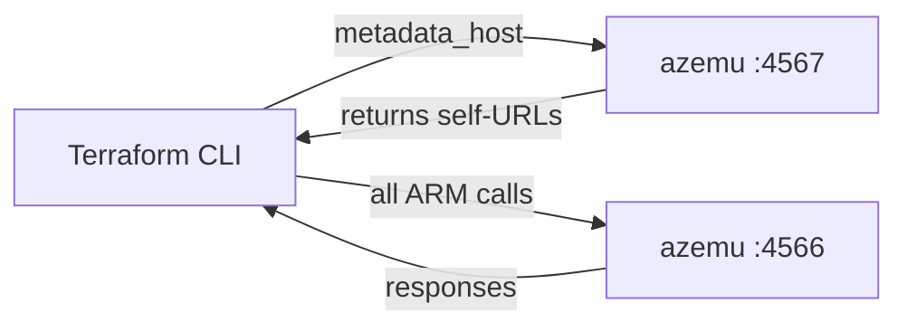
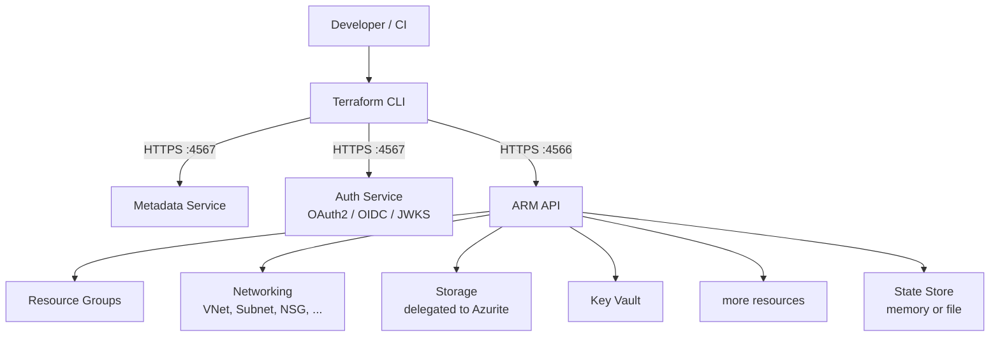

# How It Works

## The metadata_host trick

The `hashicorp/azurerm` Terraform provider has a `metadata_host` configuration
field. When set, the provider calls `https://{metadata_host}/metadata/endpoints`
to discover Azure service URLs instead of using its built-in cloud profiles.

azemu serves this endpoint and returns URLs pointing back to itself. All
subsequent ARM calls, token requests, and data-plane calls stay local.



Your Terraform configuration points at azemu like this:

```hcl
provider "azurerm" {
  features {}
  metadata_host           = "localhost:4567"
  skip_provider_registration = false
}
```

## Why HTTPS is required

The azurerm provider inspects the `resourceManager` URL from the metadata
response. If it uses `http://` instead of `https://`, the provider classifies
the environment as Azure Stack and refuses to connect.

azemu serves both ports over HTTPS using a self-signed ECDSA P-256 certificate
to avoid this classification. The certificate is generated at first start and
persisted at `.azemu/cert-bundle.pem`. You export `SSL_CERT_FILE` pointing at
that path so the Go TLS stack trusts it.

## Ports

| Port | Protocol | Purpose |
|------|----------|---------|
| 4566 | HTTPS | ARM API, data plane |
| 4567 | HTTPS | Metadata service, OAuth2, OIDC |
| 4568 | HTTP | Health check (container probes, no TLS) |

## Request flow



On startup, azemu generates (or reloads) a self-signed certificate and starts
both HTTPS servers. The state store holds every resource in memory by default;
pass `--persist` to write it to disk so state survives a restart.
